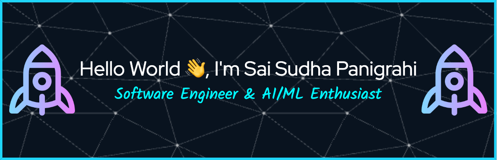

<!--
<h2 align="center">Hello World 👋, I'm Sai Sudha Panigrahi</h2>
<h3 align="center">An Experienced Full-Stack Software Engineer & AI/ML Enthusiast</h3>
-->

- 👨‍💻 I’m currently pursuing Masters in CS at the [University of Southern California](https://www.usc.edu/)

- 💼 I have previously worked as a Software Engineer at D.E. Shaw, Oracle and Locad 

- 🔭 I’m actively seeking **Summer '25 Internships** in the United States
  
- 📫 How to reach me **saisudha@usc.edu**

- 📄 Download my **Resume** **[Resume Link](https://www.dropbox.com/scl/fi/l3ddy8a7wmcvrv1hz0mmp/Resume_SWE_SSP.pdf?rlkey=2gp9dt6si4dn0yi3mwv0tbkx0&st=ihnl73l2&dl=0)**

<h4 align="left" style="display: inline;">Connect with me:</h4> 

<h3 align="center">🚀 Technology Stack</h3>

|               |           |
|       ---     |    ---    |
| `Languages & Frameworks`   |             |
| `Web Development`     |        |
| `Tools & Platforms`       |          |
| `Development Methodologies` |   |
| `Machine Learning & AI` |         |

- Check out some of my **Projects** and **Research Publications** below ⬇
